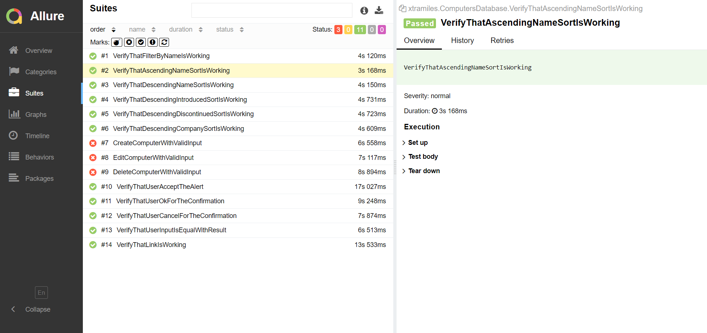

# Xtramile Selenium With C#

This repository contains a sample Selenium project written in C# and utilizing NUnit for test automation. The project is intended for tasks provided by Xtramile during the hiring process. 

## Prerequisites

Before running the tests, ensure that you have the following prerequisites installed on your machine:

- [Visual Studio Code](https://code.visualstudio.com/)
- [.NET SDK](https://dotnet.microsoft.com/download)

## Clone the Repository

To get started, clone this repository to your local machine using Git. Open your terminal and run:

```bash
git clone https://github.com/rahdian-abdi/xtramile-selenium-csharp.git
```

## Running the Tests

Follow these steps to run the tests using Visual Studio Code:

1. Open the project folder in Visual Studio Code:

   ```bash
   code xtramile-csharp-selenium
   ```

2. Open a new terminal in Visual Studio Code.

3. Restore project dependencies:

   ```bash
   dotnet restore
   ```

4. Build the project:

   ```bash
   dotnet build
   ```

5. Run the tests:

   ```bash
   dotnet test
   ```

   This will execute the NUnit tests, and you will see the test results in the terminal.

## Reporting

Test results are reported using Allure Reports. The reports are generated in the `bin\Debug\net7.0\allure-results` folder within the project directory. You should install the Allure.NUnit3 :

```bash
dotnet add package Allure.NUnit3
```

After running the tests, you have to build the reports to view the results with this command :

```bash
allure serve bin\Debug\net7.0\allure-results
```

Below is a sample test report generated by Extent:



## Test Documentation

The Test Documentation consists of two applications: Computers Database and JavaScript Alert.

- [Test Documentation](https://docs.google.com/spreadsheets/d/14i5wSsOGj3w2E-vsBhSGcolysA0-k_7yf0pVMjE_oVM/edit?usp=sharing)

## Project Structure

- `TestCases` folder contains your NUnit test classes.
- `BasePage.cs` contains the base class for Selenium operations.


## Resources

- [NUnit Documentation](https://docs.nunit.org/)
- [Selenium Documentation](https://www.selenium.dev/documentation/en/)
- [Visual Studio Code Documentation](https://code.visualstudio.com/docs)